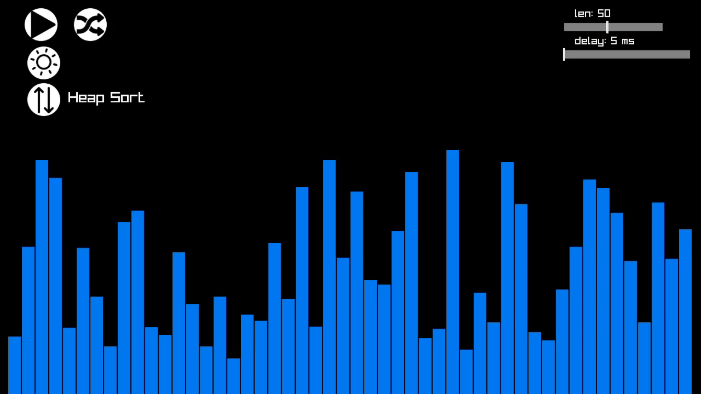

# sort algorithm visualizer
sort algorithm visualizer made in go using <a href='https://github.com/gen2brain/raylib-go'>raylib-go</a> (go binding of <a href='https://github.com/raysan5/raylib'>raylib</a>)



# build
Download or clone repository 
```sh
git clone https://github.com/rzaf/sortVisualizer.git

cd sortVisualizer
go get -u github.com/gen2brain/raylib-go/raylib
```

```sh
go run cmd/sort-visualizer/main.go
```
Binary should be in same directory as `resources` directory

